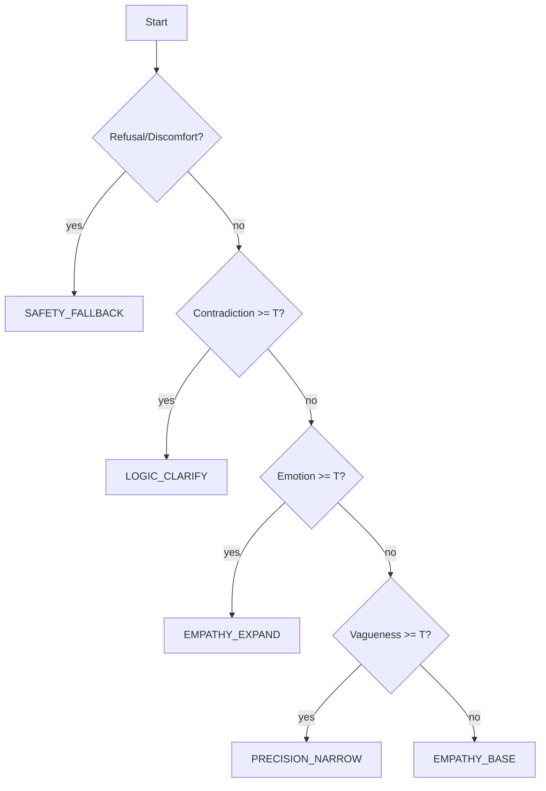

# Origins Interview Engine — Persona Router + Depth Governor (Design Spec)
**Version:** 1.0  
**Date:** 2025-12-30  
**Owner:** Terry  
**Status:** Draft (Engineering Authority)

---

## Table of Contents
1. [Purpose](#purpose)  
2. [Non-Goals](#non-goals)  
3. [Definitions](#definitions)  
4. [System Overview](#system-overview)  
5. [Inputs](#inputs)  
6. [Routing Policy](#routing-policy)  
7. [Depth Governor](#depth-governor)  
8. [Safety Overlay](#safety-overlay)  
9. [Turn Output Contract](#turn-output-contract)  
10. [Configuration Artifacts](#configuration-artifacts)  
11. [Logging & Observability](#logging--observability)  
12. [Failure Handling](#failure-handling)  
13. [Open Questions](#open-questions)  
14. [Appendix A — Reference Schemas](#appendix-a--reference-schemas)

---

## Purpose
Origins is an AI memoir interviewer. The **Interview Engine** is the behavior control plane that:
- Selects the appropriate **persona style** per turn (Router).
- Limits and governs probing **depth** and recursion (Depth Governor).
- Enforces **psychological safety** constraints (Safety Overlay).

The engine consumes research outputs (persona profiles, state machines, negative constraints) and runtime signals (vagueness, emotion, contradiction, refusal) to produce a bounded, auditable interviewer response.

---

## Non-Goals
The Interview Engine **must not**:
- Diagnose mental health conditions.
- Provide medical/legal advice.
- Coerce disclosure of trauma or sensitive information.
- Assume facts not in evidence.
- Replace therapy, crisis support, or professional care.

The Interview Engine **does**:
- Support narrative recall and detail capture.
- Offer user choice and control.
- De-escalate on refusal, distress, or uncertainty.

---

## Definitions
- **Persona**: A style module (e.g., Empathy-base warmth, Precision precision, Logic clarification) expressed as *templates, tactics, and constraints*, not celebrity imitation.
- **Depth level**: A bounded integer indicating intimacy/sensitivity of the current thread (0–3).
- **Recursion**: A looped follow-up sequence within a persona state machine.
- **Safety signal**: Any indicator to pause, de-escalate, or change topic.
- **State machine**: Declarative logic describing entry conditions, states, transitions, exit conditions, and fallbacks.

---

## System Overview

### Components
- **Router**: Chooses persona + which state machine (if any) should run for the next turn.
- **Depth Governor**: Allows, denies, or reduces depth changes; caps recursion.
- **Safety Overlay**: Applies negative constraints pre/post generation and may override routing.
- **Generator**: LLM call using the selected persona templates + constraints.
- **Evaluator**: Computes metrics (verbosity, question density, ratios) for logging and regression tests.

### Data Flow Diagram (Mermaid)
```mermaid
flowchart LR
  U[User Input] --> S[Signal Extractor]
  S --> R[Persona Router]
  S --> D[Depth Governor]
  R --> P[Persona/State Machine Selector]
  D --> GATE[Depth/Recursion Gate]
  P --> GEN[LLM Generator]
  GATE --> GEN
  NC[Negative Constraints] --> SAFE[Safety Overlay]
  SAFE --> GEN
  GEN --> POST[Post-Check (Safety + Verbosity)]
  POST --> OUT[Response + Turn Contract]
  OUT --> LOG[Telemetry / Audit Log]
```

---

## Inputs

### A) Research Outputs (Artifacts)
- `persona_profiles.json`  
  - verbosity ratios, avg turn/question lengths  
  - sentence-type distributions  
  - softener lexicon with tags  
- `state_machines.json`  
  - `precision_narrowing` (Precision)  
  - `emotional_expansion` (Empathy)  
  - `inconsistency_resolution` (Logic)  
- `negative_constraints.json`  
  - failure modes → prohibited patterns → fallbacks  
- `system_prompt_block.txt`  
  - ≤300-word unified instruction block

### B) Runtime Signals (Derived from conversation)
Minimum required signals per turn:
- `vagueness_score` (0–1)
- `emotion_score` (0–1)
- `contradiction_score` (0–1)
- `refusal_or_discomfort` (boolean)
- `conversation_phase` (warmup | narrative | depth | reflection | close)

Optional signals:
- `user_initiated_elaboration` (boolean)
- `topic_id` (thread identifier)
- `prior_depth_level` (int)

---

## Routing Policy

### Priority Order (highest wins)
1. **Safety override** (refusal/discomfort/distress)  
2. **Contradiction resolution** (clarify)  
3. **High emotion** (expand, bounded)  
4. **Vagueness** (precision, bounded)  
5. **Default** (warm narrative facilitation)

### Policy (normative)
- If `refusal_or_discomfort == true`, route to `SAFETY_FALLBACK` and **do not** increase depth.
- Else if `contradiction_score >= CONTRADICTION_THRESHOLD`, route to `LOGIC_CLARIFY` with **single-step** resolution.
- Else if `emotion_score >= EMOTION_THRESHOLD`, route to `EMPATHY_EXPAND` with bounded loop.
- Else if `vagueness_score >= VAGUENESS_THRESHOLD`, route to `PRECISION_NARROW` with bounded loop.
- Else route to `EMPATHY_BASE`.

### Router Decision Diagram (Mermaid)


---

## Depth Governor

### Depth Levels
- **0 — Warm-up:** low intimacy; safe, factual; no probing.
- **1 — Narrative:** “what happened”; concrete details; minimal emotion probing.
- **2 — Reflection:** meaning, impact, lessons; careful emotional expansion.
- **3 — Sensitive core:** grief/shame/trauma; only with consent and strong safety.

### Core Rules (binding)
- Never increase depth if `refusal_or_discomfort == true`.
- Never increase depth twice in a row without **user-initiated elaboration**.
- Always provide a “step sideways” option when emotion is high.
- Cap recursion per state machine invocation:
  - Precision Narrowing: `max_steps = 2`
  - Emotional Expansion: `max_steps = 2`
  - Inconsistency Resolution: `max_steps = 1`

### Depth Escalation Gate
Depth may increase by **at most +1** if:
- `user_initiated_elaboration == true` **or** explicit user consent is present, and
- `emotion_score < DISTRESS_HARD_STOP_THRESHOLD`, and
- the topic has remaining depth budget.

### Depth Budget
Per-topic (thread) budget example:
- `max_depth` (default 2)
- `max_sensitive_depth` (default 3 but requires consent flags)
- `max_escalations_per_topic` (default 2)

---

## Safety Overlay

### Negative Constraints
Negative constraints are derived from failure mode analysis and include:
- Prohibited diagnostic language
- Coercive disclosure demands
- Leading questions that assume trauma
- Accusatory phrasing in contradiction handling
- Excessive verbosity (monologue)

### Pre-Generation Enforcement
- Attach relevant prohibited pattern set to the LLM call.
- Attach required fallback templates where needed.

### Post-Generation Checks
Reject/replace candidate output if it violates:
- any prohibited pattern
- max token/length constraints
- question density cap
- “therapy framing” detector

On rejection: emit `SAFETY_FALLBACK` response and log override.

---

## Turn Output Contract
Every produced turn must return:

```json
{
  "persona_used": "EMPATHY_BASE|EMPATHY_EXPAND|PRECISION_NARROW|LOGIC_CLARIFY|SAFETY_FALLBACK",
  "topic_id": "string",
  "conversation_phase": "warmup|narrative|depth|reflection|close",
  "depth_level_before": 0,
  "depth_level_after": 0,
  "tactic_used": "string",
  "loop_state": "string|null",
  "safety_action": "none|deescalate|stop|redirect|override",
  "metrics": {
    "response_tokens": 0,
    "question_count": 0,
    "question_tokens_mean": 0
  },
  "response_text": "string"
}
```

---

## Configuration Artifacts
Recommended layout:

```
/config/interview-engine/
  router-policy.json
  depth-governor.json
  state-machines.json
  negative-constraints.json
  persona-profiles.json
  system-prompt-block.txt
```

Implementation should treat these as authoritative and versioned.

---

## Logging & Observability
Minimum required telemetry (per turn):
- routing decision + winning rule
- signal scores
- depth decision and reason
- safety overrides and violated rule ids
- verbosity metrics (tokens, question density)
- loop steps executed

---

## Failure Handling
When ambiguity or risk is high:
- Prefer **stabilize + choice**.
- Reduce depth or hold depth constant.
- Log: `"safety_action": "deescalate"` and the trigger.

Hard-stop cases:
- user asks to stop
- user expresses acute distress
- user indicates self-harm intent (route to safe response + crisis guidance policy in product, if applicable)

---

## Open Questions
- How is `contradiction_score` computed: heuristic-only or model-assisted?
- How is `topic_id` assigned and maintained across turns?
- Do we allow different depth budgets per user profile (opt-in)?

---

## Appendix A — Reference Schemas
See JSON Schema files:
- `router-policy.schema.json`
- `depth-governor.schema.json`
- `state-machines.schema.json`
- `negative-constraints.schema.json`
- `turn-contract.schema.json`
